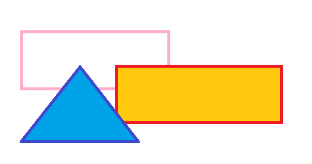

# title
# toc
# 基本
### 列挙(フラット)
基本的な動作のチェック．
* アイテム1
* アイテム2
* アイテム3
* アイテム4

### 列挙(階層)
* アイテム1
* アイテム2
  * アイテム2-1
  * アイテム2-2
* アイテム3
  * アイテム3-1
    * アイテム3-1-1

### 数字付き列挙(フラット)
1. アイテム1
1. アイテム2
1. アイテム3
1. アイテム4
yyyxxx

### 数字付き列挙(階層)
1. アイテム1
1. アイテム2
  1. アイテム2-1
  1. アイテム2-2
1. アイテム3
  1. アイテム3-1
    1. アイテム3-1-1

### 引用

> 文頭に>を置くことで引用になります。
> 複数行にまたがる場合、改行のたびにこの記号を置く必要があります。
> 引用の上下にはリストと同じく空行がないと正しく表示されません
> 引用の中に別のMarkdownを使用することも可能です。

### 表

| Left align | Right align | Center align |
|:-----------|------------:|:------------:|
| This       | This        | This         |
| column     | column      | column       |
| will       | will        | will         |
| be         | be          | be           |
| left       | right       | center       |
| aligned    | aligned     | aligned      |

# 応用
### コードの引用

```
(leaf elscreen
  :ensure t
  :preface
  (global-unset-key (kbd "C-z"))
  :custom
  (elscreen-tab-display-kill-screen . nil)
  (elscreen-tab-display-control . nil)
  (elscreen-display-screen-number . nil)
  :config
  (global-set-key (kbd "s-t") 'elscreen-create)
  (global-set-key (kbd "s-d") 'elscreen-kill)
  :hook (after-init-hook . elscreen-start)
  )
```

### 画像 (成り行き配置)


### 画像 (絶対位置)


### 数式
$x^2+x+1$

### コードからの作図1

追加ライブラリをつかって(mdfigure)MDベースのコードから図を作って挿入できる．

```tmpl:stepup{w=0.9, h=0.5}
* 現在
* ちょっと未来
* 遠い未来
```

### コードからの作図2

追加ライブラリをつかって(mdfigure)MDベースのコードから図を作って挿入できる．

```tmpl:desc{w=0.9, h=0.5}
現在:現実をしっかり見つめましょう．ただしい状況認識は未来への第一歩．
ちょっと未来:具体的な行動を．
遠い未来:大きな夢を持っていきましょう
```

### debug
最終行が列挙だと動かないバグがあったので確認のため．
* test
* test

# end
