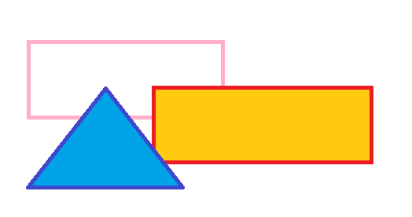
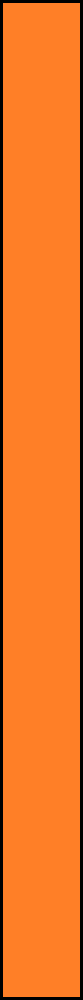

# title
# toc
# 基本

### 文章の基本構成
「#」と「##」で章を定義する．
プレゼンテーション内の目次およびPDF(最終出力)のしおりに反映される．

スライドは「###」で定義する．

### 段落と装飾
段落を変える際には，空行を挿入する．
テキストに改行を入れただけでは，同じ段落の続きとして処理される．

強調には**アスタリスク**を使う．
または__アンダースコア__でもよい．
取り消し線には~~チルダ~~を使う． 

### 列挙(フラット)
* アイテム1
* アイテム__2__
* アイテム**3**
* アイテム~~4~~

### 列挙(階層)
* アイテム1
* アイテム2
  * アイテム2-1
  * アイテム2-2
* アイテム3
  * アイテム3-1
    * アイテム3-1-1

### 列挙(表形式)
2階層の列挙を表形式で組版できる．
1階層目がタイトルカラムで，2階層目が列挙になる．
カラム幅をオプションで指定できる．
* {table}{0.2, 0.6}
* アイテム1
  * アイテム1a
  * アイテム1b
  * アイテム1c
* アイテム2
  * アイテム2a
  * アイテム2b

### 数字付き列挙(フラット)
1. アイテム1
1. **アイテム**2
1. __アイテム__3
1. ~~アイテム~~4

### 数字付き列挙(階層)
1. アイテム1
1. アイテム2
  1. アイテム2-1
  1. アイテム2-2
1. アイテム3
  1. アイテム3-1
    1. アイテム3-1-1

### 引用
> {w=0.9}
> 文頭に>を置くことで引用になります。
> 複数行にまたがる場合、改行のたびにこの記号を置く必要があります。
> 引用の上下にはリストと同じく空行がないと正しく表示されません
> 引用の中に別のMarkdownを使用することも可能です。

中括弧を使って，引用枠の幅を変更することができる．
```
> {w=0.9}
> 文頭に>を置くことで引用になります。
> 複数行にまたがる場合、改行のたびにこの記号を置く必要があります。
```

### 表 (booktabs + colortbl)
文書向けの表組は，プレゼンテーションでは少し寂しいので，booktabs, colortbl パッケージを使って組版する．

| Left align | Right align | Center align |
|:-----------|------------:|:------------:|
| This       | This        | This         |
| column     | column      | column       |
| will       | will        | will         |
| be         | be          | be           |
| left       | right       | center       |
| aligned    | aligned     | aligned      |

### 2ペイン{2panes:0.75,0.25,tf}
* このようにスライドを左右に2分割することができる．
* horizontal rules の記法で左右を区切る．

```
### スライドタイトル{2panes:0.5,0.5,tf}
左側
---
右側
```

---


### URL (hyperref)
URLとテキストが異なる場合: 
[Google](http://www.google.com)

URLをそのまま載せる場合: 
[](http://www.google.com)

* [G](http://www.google.com)
* [](https://www.apple.com/us/shop/goto/buy_accessories)

1. [F](http://www.facebook.com)
2. [](http://www.amazon.com)

### コードの引用 (lstlisting)
```
(leaf elscreen
  :ensure t
  :preface
  (global-unset-key (kbd "C-z"))
  :custom
  (elscreen-tab-display-kill-screen . nil)
  (elscreen-tab-display-control . nil)
  (elscreen-display-screen-number . nil)
  :config
  (global-set-key (kbd "s-t") 'elscreen-create)
  (global-set-key (kbd "s-d") 'elscreen-kill)
  :hook (after-init-hook . elscreen-start)
  )
```

### 画像(1)
* includegraphics を使って画像を読み込み．
* 角括弧の中に指定したオプションは，変換の後にBeamerに渡される
  - w=0.5 → width=0.5$\backslash$textwidth
  - h=0.5 → height=0.5$\backslash$textheight
  - s=0.2 → scale=0.2


### 画像(2)
* 縦長の画像の処理．


### 数式
$x^2+x+1$

# md2x の特殊仕様

### 条件コンパイル
C言語の ifdef 記法(もどき)で条件コンパイルができる．
コンパイルフラグは --cflags オプションで与える．

#ifdef abc
abc
abc2
#else
cee
cde
#endif

### 外部ファイルの読み込み

C言語の include 記法(もどき)で外部ファイルを取り込める．
C言語と同様に，前処理は他の一切の処理に先立って行われる．

#include "include_sample.md"

#include "snippet_sample.md"

### コードからの作図1

追加ライブラリをつかって(mdfigure)MDベースのコードから図を作って挿入できる．

```tmpl:stepup{w=0.9, h=0.5}
* 現在
* ちょっと未来
* 遠い未来
```

### コードからの作図2

追加ライブラリをつかって(mdfigure)MDベースのコードから図を作って挿入できる．

```tmpl:desc{w=0.9, h=0.5}
現在:現実をしっかり見つめましょう．ただしい状況認識は未来への第一歩．
ちょっと未来:具体的な行動を．
遠い未来:大きな夢を持っていきましょう
```
# テスト
### 文字列のエスケープ
文字列中に & が入っている場合。念のため & もうひとつ。

# end
